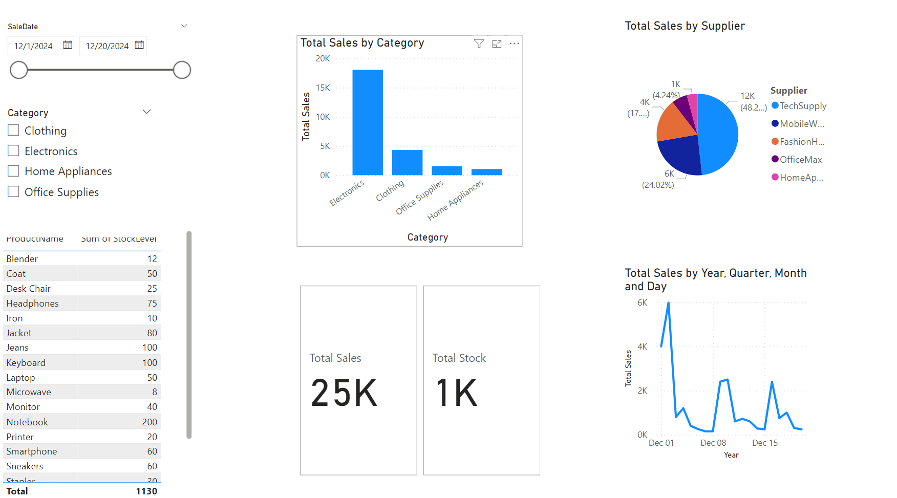
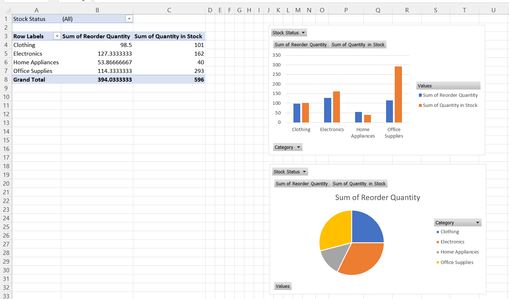
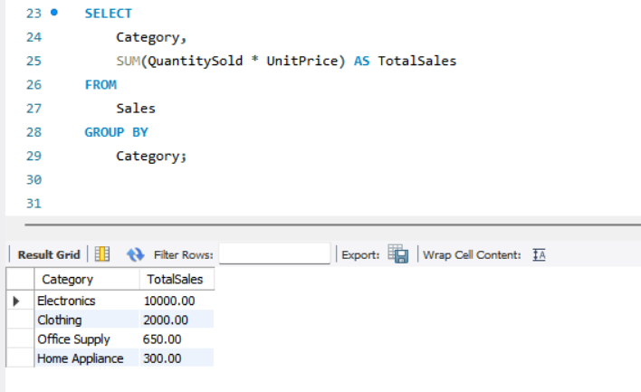
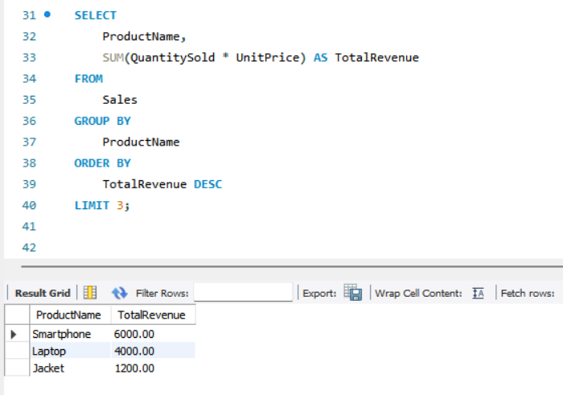
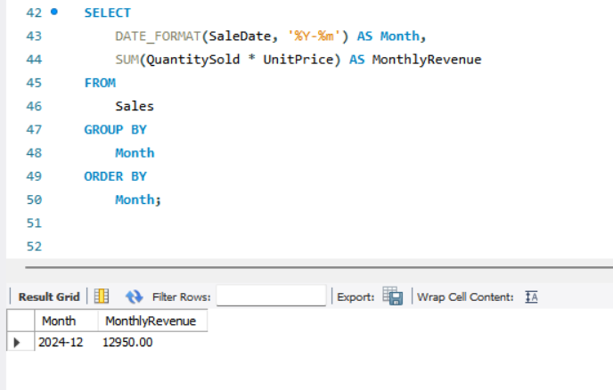

# Data Analysis Projects

This repository contains three data analysis projects showcasing the use of **Excel**, **SQL**, and **Power BI** for practical business problems. Each project involves data cleaning, analysis, and visualization.

---

## Projects

### 1. Inventory Management Tracker (Excel)
- **Description**: An Excel-based project to analyze inventory levels, calculate reorder quantities, and visualize stock status.
- **Key Features**:
  - Conditional formatting to highlight low-stock items.
  - Pivot tables for summarizing stock by category.
  - Visualizations for inventory insights.

#### Data Cleaning Steps:
- Removed duplicate rows to ensure each inventory item appears only once.
- Corrected inconsistent category names (e.g., "Electronics" vs. "electronics").
- Standardized date formats for better sorting and filtering.
- Filled missing values in the `Lead Time` column with the category average.

#### Files:
- `inventory_management.xlsx`: The Excel file with formulas, pivot tables, and visuals.

---

### 2. Sales Data Analysis (SQL)
- **Description**: SQL queries to analyze sales trends, calculate metrics, and extract insights from a mock sales dataset.
- **Key Queries**:
  - Total sales by category.
  - Top-performing products.
  - Monthly sales trends.

#### Data Cleaning Steps:
- Removed invalid records where `QuantitySold` or `UnitPrice` was null or zero.
- Used SQL functions to:
  - Normalize product names (e.g., removing extra spaces).
  - Parse and standardize `SaleDate` into `YYYY-MM-DD` format.
- Identified and corrected mismatched category entries using a lookup table.

#### Files:
- `sales_analysis.sql`: SQL script containing the queries.
- `sales_data.csv`: Cleaned sales data.

---

### 3. Sales Performance Dashboard (Power BI)
- **Description**: A Power BI dashboard to visualize sales performance and stock levels using two connected datasets.
- **Key Features**:
  - Interactive slicers for filtering by category and supplier.
  - Visualizations: Bar charts, line charts, and cards for KPIs.
  - Cross-filtering and drill-down functionality.

#### Data Cleaning Steps:
- **Sales Data**:
  - Removed sales records with invalid or future dates.
  - Checked for outliers in `QuantitySold` and `UnitPrice` using descriptive statistics.
  - Standardized product names to match the `Product_Details` dataset.
- **Product Details Data**:
  - Filled missing `ReorderLevel` values with the median of the respective supplier's products.
  - Merged duplicate entries for the same product under different suppliers.

#### Files:
- `sales_dashboard.pbix`: Power BI project file.
- `sales_data.csv`: Cleaned sales dataset.
- `product_details.csv`: Cleaned product details dataset.

---


## Screenshots

### Power BI Dashboard


### Excel Pivot Table


### SQL Project

- **Total Sales by Category Query and Result**

  

- **Top 3 Best-Selling Products Query and Result**

  

- **Monthly Sales Trend Query and Result**

  

---

## How to Use
1. Clone this repository:
   ```bash
   git clone https://github.com/Taha-Najafzadeh/Supply-Chain-Management-SCM-.git
